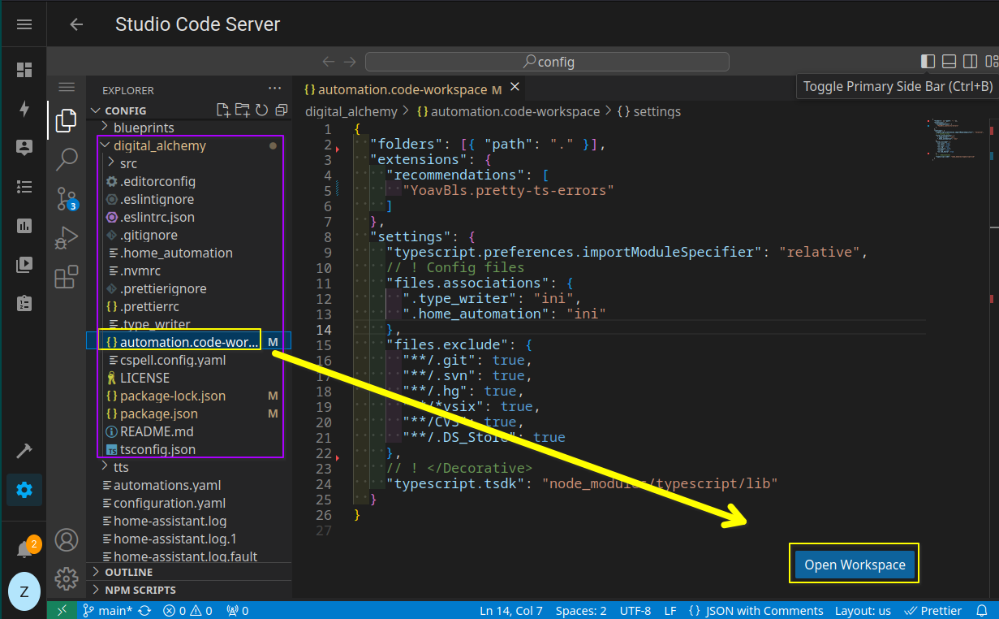
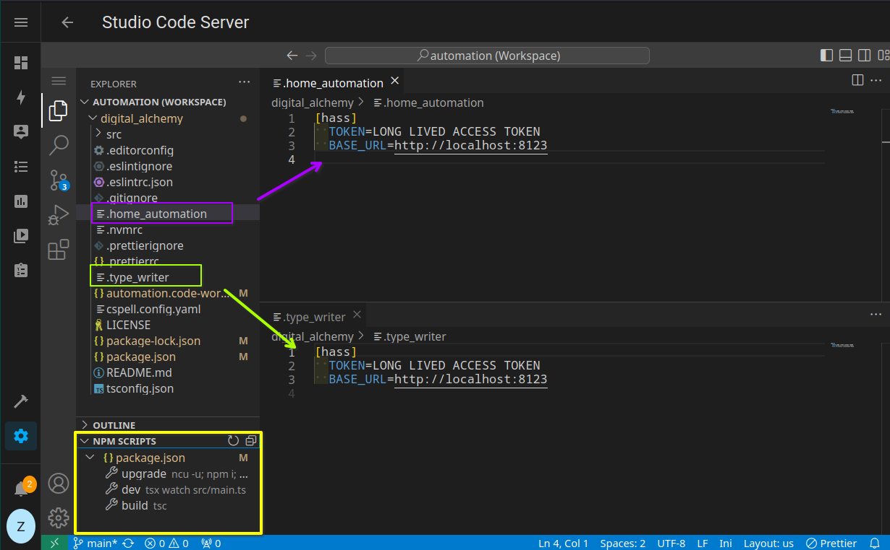
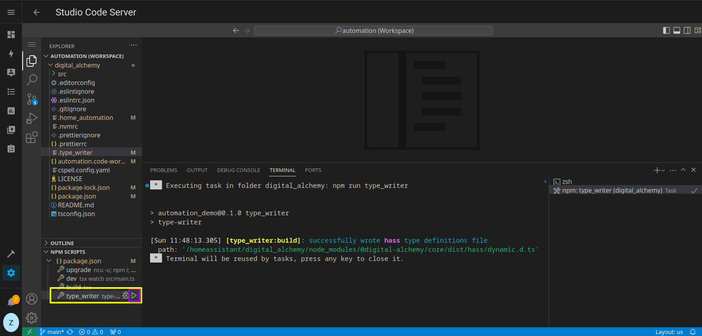

# Digital Alchemy Starter Repo 🏡💻

> [!attention] Provide a link to the Code Server Addon.

Welcome to the Home Assistant TypeScript Integration Template, hosted at [zoe-codez/automation-template](https://github.com/zoe-codez/automation-template)! This repository is designed to kickstart your journey with TypeScript in Home Assistant.

These instructions are tailored for setting up the **Studio Code Server Addon** to utilize the library, though adjustments may be needed depending on your setup.

## 🚀 Setup

Within the **Code Server Addon**:

1. **Open a terminal**
   - Press **Ctrl-Shift-\`** (default keybind) to open a terminal, or go through `Menu` > `Terminal` > `New Terminal`.
2. **Execute the command** ⌨
```bash
curl -fsSL https://setup.digital-alchemy.app | bash
```
This script will:
- Install Node.js on your system
- Clone this repository
- Install all necessary dependencies
- Add the [synapse](https://github.com/zoe-codez/synapse) custom component

> Upon completion, your directory should look like this:

[](./docs/workspace_open.png)


Locate the workspace file inside, open it, and click **Open Workspace**. This grants access to the **NPM Scripts** panel, facilitating easy management of your workspace and execution of code.

### ⚒️ Workspace Management

Available scripts include:

- **upgrade** : Updates to the latest versions of dependencies.
- **type_writer**: Generates custom type definitions anew.
- **develop**: Initiates `src/main.ts` in watch mode for real-time code updates.
	- ⚡ Handle with care!
- **build**: Executes the TypeScript build to verify code accuracy.
- **stage**: Launches the automation code from the build in the terminal.
- **deploy**: Uses `pm2` for background deployment.

### ⚙️ Configuration

[](./docs/setup.png)

**Configuration Steps:**

1. **Home Assistant Access Token**:
   - Generate a long-lived token from your Home Assistant profile.
   - Securely store this token for `.type_writer` and `.home_automation` configurations.

2. **Configure `.type_writer` and `.home_automation`**:
   - Input your Home Assistant URL and access token into both files for uninterrupted integration.

[](./docs/valid_build.png)

Run this setup anytime to update to the latest definitions from your Home Assistant instance.

### 📚 Additional Information

- **Comprehensive Examples**: Explore [`mock-home`](https://github.com/zoe-codez/mock-home) for detailed demonstrations of patterns and tools.
- **Synapse Custom Component**: Install [Synapse](https://github.com/zoe-codez/synapse) through HACS as a custom repository to fully unlock its capabilities.

## License 📄

This project is licensed under the MIT License, as detailed in the LICENSE file.
