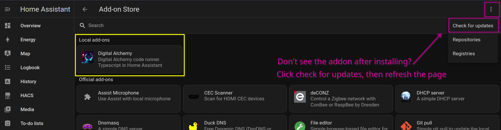

# Digital Alchemy Starter Repo 🏡💻

Welcome to the Digital Alchemy Starter Repo!

This repository is designed to work with **Supervised** and **HA OS** based installs, where **Addons** are supported. See [installation documentation](https://www.home-assistant.io/installation/#advanced-installation-methods) for a comparison of different installation types. These instructions assume that [Studio Code Server Addon](https://github.com/hassio-addons/addon-vscode) has been installed, serving as both editor and workspace management tool.

- 🗣️ Join [Discord](https://discord.gg/JkZ35Gv97Y)
- 📖 More about the **Quickstart** project https://docs.digital-alchemy.app/Automation-Quickstart
- 🤖 What next? https://blog.digital-alchemy.app/Next-Steps

## 🚀 Setup

Within the **Code Server Addon**:

1. **Open a terminal**
   - Press **Ctrl-Shift-\`** (default keybind) to open a terminal, or go through `Menu` > `Terminal` > `New Terminal`.
2. **Execute the command** ⌨
```bash
curl -fsSL https://setup.digital-alchemy.app -o setup.sh; bash setup.sh
```
This script will:
- Install NodeJS on your system
- Clone this repository
- Install all necessary dependencies
- Add the local code runner addon as a local addon



### ⚙️ Manual Configuration

This project ships with 2 relevant configuration files in the project root.
Most configurations have library provided defaults for most values, but [BASE_URL](https://docs.digital-alchemy.app/Home+Automation/Hass/config/BASE_URL) & [TOKEN](https://docs.digital-alchemy.app/Home+Automation/Hass/config/TOKEN) are required for establishing a basic connection

1. [`.type_writer`](./.type_writer) - credentials for the `type-writer` script
2. [`.home_automation`](./.home_automation) - credentials for your application

If you are running the code within an addon, then the Home Assistant credentials **are not required**. Below is an example config in `ini` format

```ini
[hass]
  TOKEN=LONG LIVED ACCESS TOKEN
  BASE_URL=http://homeassistant.local:8123
```

> [Configuration](https://docs.digital-alchemy.app/Core/Configuration) system overview

## ⚒️ Workspace Management

### Supervised / HAOS

The NodeJS environment within the Code Server addon does not survive reboots, and may occasionally need to be set up again. A script has been provided to restore your environment if something goes wrong.
```bash
> ./scripts/environment.sh
```
> Also accessible as a task within VSCode as part of the workspace. Use `Tasks: Run Task` from the command palette to access

### Other

For **all other setups**, the instructions are roughly the same. `Node20`+ is required, [fnm](https://github.com/Schniz/fnm) can be used to install / manage version if you do not have it installed already.

## 💻 Commands

Once your environment is set up, you can use provided commands from within the `package.json` to manage your workspace.

| NPM Command | Description |
| ---- | ---- |
| **`upgrade`** | ⏺️ Upgrade all `package.json` dependencies<br>**Automatically runs `type-writer` afterwards** |
| **`develop`** | ⏩ Run the development server from within the `Code Server` addon<br>**Not intended for long term deployments!** |
| **`develop:watch`** | 👀 Run the development server in watch mode from within the `Code Server` addon<br>**Automatically restart server on code changes** |
| **`setup:addon`** | 🔁 Reinstall the code runner addon. <br>**Uses name in `package.json` to determine install path** |
| **`build`** | 🔨 Create a build of your code in the `dist/` folder<br>**Reports all the errors in your workspace** |
| **`build:deploy`** | 🏗️ Create a build of your code in the `deploy/` folder<br>**Addon has been set up to run from here** |
| **`lint`** | 😱 Check your workspace for non-critical issues |
| **`lint:fix`** | 🪛 Run `eslint --fix` to resolve minor issues |
| **`type-writer`** | 🖨️ Rebuild custom type definitions for Home Assistant<br>**Run any time you modify your setup for more accurate definitions** |


## 🤝 Related Projects

| GitHub                                                                       | Description                                                          | NPM                                                                                     |
| ---------------------------------------------------------------------------- | -------------------------------------------------------------------- | --------------------------------------------------------------------------------------- |
| (installed) [core](https://github.com/Digital-Alchemy-TS/core)               | Boilerplate services, configuration, logging, and more.              | [@digitial-alchemy/core](https://www.npmjs.com/package/@digital-alchemy/core)           |
| (installed) [hass](https://github.com/Digital-Alchemy-TS/hass)               | Websocket & rest adapters for Home Assistant.                        | [@digitial-alchemy/hass](https://www.npmjs.com/package/@digital-alchemy/hass)           |
| (installed) [type-writer](https://github.com/Digital-Alchemy-TS/terminal)    | Generate custom type definitions from your Home Assistant install.   | [@digital-alchemy/type-writer](https://www.npmjs.com/package/@digital-alchemy/terminal) |
| (local) [code runner addon](./addon/README.md)                               | Detailed notes on usage of the `@digital-alchemy` code runner addon. |          **n/a**                                                                                |
| [synapse](https://github.com/Digital-Alchemy-TS/synapse)                     | Tools for generating entities within Home Assistant.                 | [@digitial-alchemy/synapse](https://www.npmjs.com/package/@digital-alchemy/synapse)     |
| [synapse-extension](https://github.com/Digital-Alchemy-TS/synapse-extension) | Custom component counterpart for `@digital-alchemy/synapse`          |             **n/a**                                                                            |

## 📄 License

This project is licensed under the MIT License, as detailed in the [LICENSE](./LICENSE) file.
